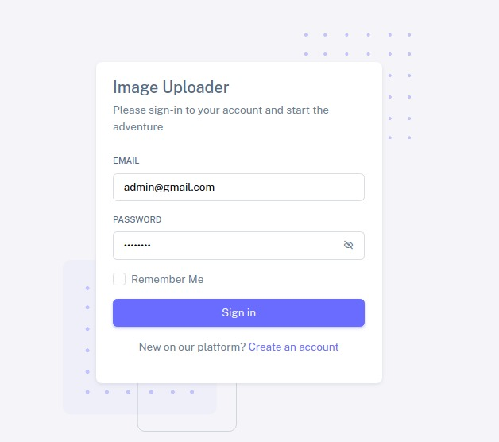
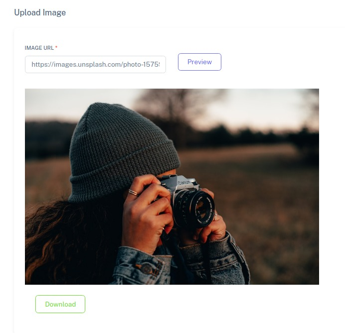
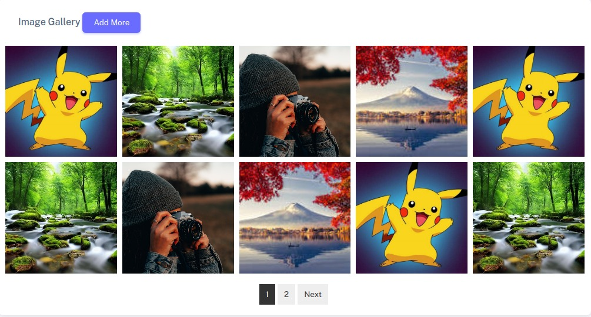

## Image Upload System

#Introduction

Provide an overview of the Image Upload System system application.Mention the technologies used, including Laravel 10,Laravel Blade, and Vue.js.

#Project Setup

1.  Mention the location of the database backup in the "db_backup" folder in the project's root directory.You need to setup the backup database .

Other wish your can simply run "php artisan migrate to start with fresh database"

#Project Module

1. User Dashboard
2. Create New Image
3. Image Gallery

#Images

